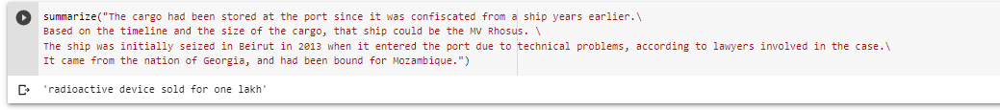

# Abstractive-Text-Summarization-model-in-Keras
Abstractive Text Summarization using Transformer model

## Description
This great notebook was fully developped by Rohan Jagtap and his initial code and project can be found [here](https://github.com/rojagtap/abstractive_summarizer).
Concepts were fully described and developped in several of his posts, providing an exhaustive explanation of Google’s Transformer model:
- [Abstractive Text Summarization Using Transformers](https://medium.com/swlh/abstractive-text-summarization-using-transformers-3e774cc42453)
- [Transformers explained](https://towardsdatascience.com/transformers-explained-65454c0f3fa7)

The training was performed using Inshorts Dataset comprised of over 55k news articles from various sources (300 to 500 words long) and their summary headlines (less than 100 words). The dataset is available [here](https://www.kaggle.com/shashichander009/inshorts-news-data).

The model uses abstractive summarizing through deep RNN encoder-decoder network architecture with attention mechanism.

The model is capable of generating a "headline" summary (up to 75 words) of a news article from scratch. New sentences are generated which might not be present in the original text.

Where extracting summarizing methods summarize articles by selecting a subset of sentences that retain the most important points (see an example in one of my other repos), abstractive summarizing methods interpret and examine the text using advanced natural language techniques in order to generate a new shorter text that conveys the most critical information from the original text.

## Results
The model uses Keras and was trained over 20 then 40 and finally 100 epochs on Google colab with GPU.
Generated headlines were concise and meaningful in majority even after 20 epochs. Yet they poorly summarized the proposed document in most cases. This could be due to overfitting the limited dataset used for training.

Example :

